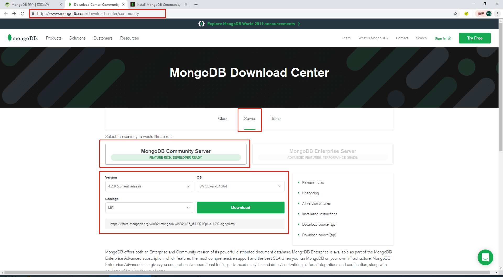
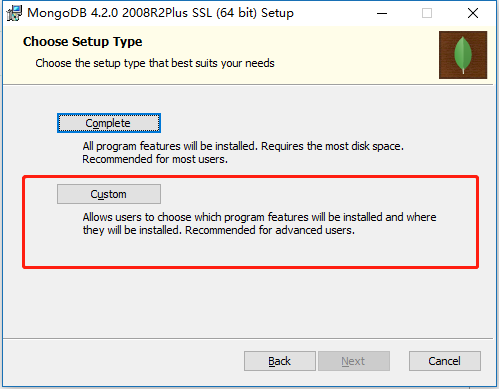
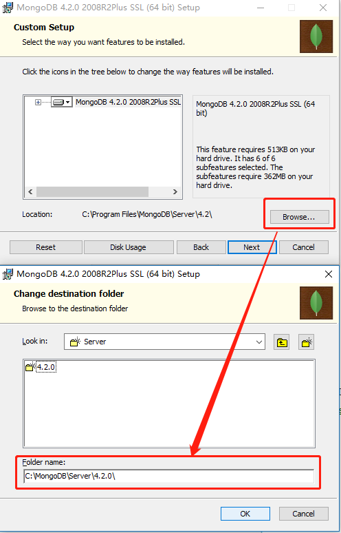
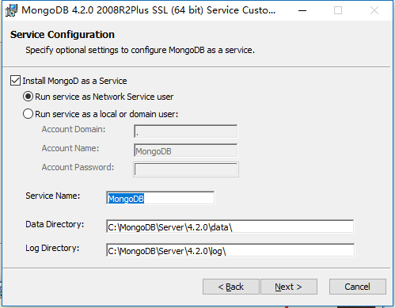
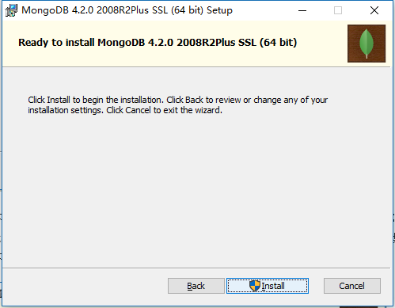
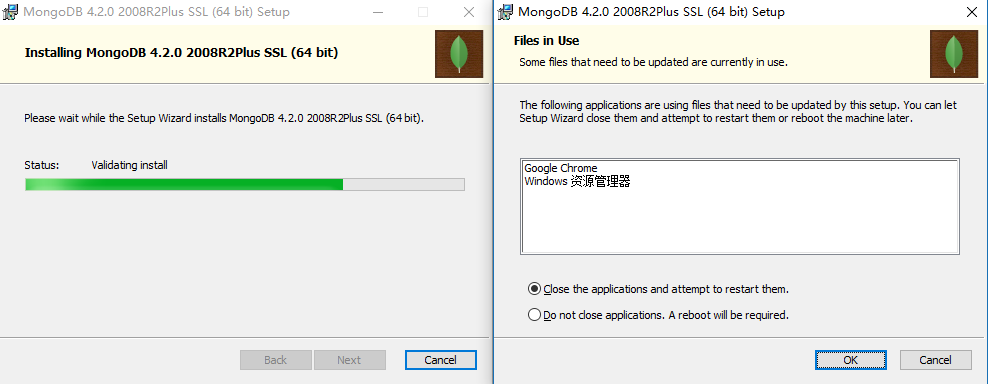
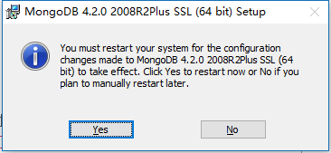
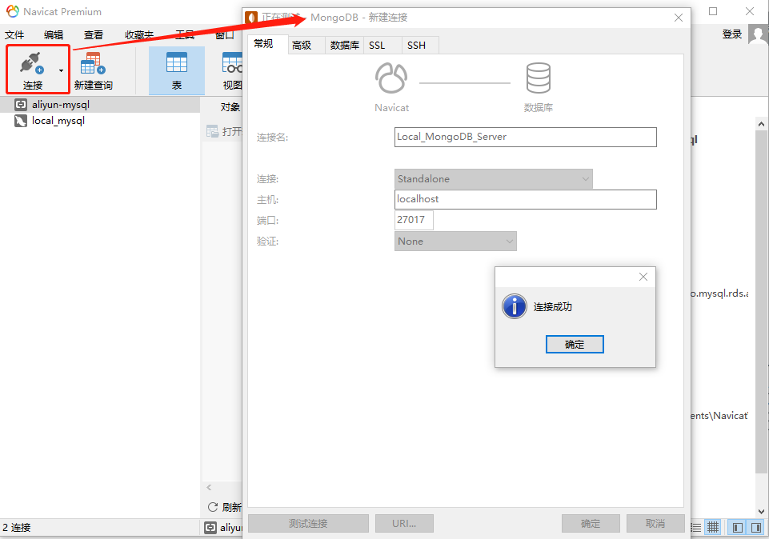

# 安装记录

## Windows 安装 MongoDBv4.2.0

下载地址:
- [官网 https://www.mongodb.com/download-center/community](https://www.mongodb.com/download-center/community)
- [链接 https://fastdl.mongodb.org/win32/mongodb-win32-x86_64-2012plus-4.2.0-signed.msi](https://fastdl.mongodb.org/win32/mongodb-win32-x86_64-2012plus-4.2.0-signed.msi)

### 开始安装



打开安装包:








下一步安装 "install mongoDB compass" 不勾选，否则可能要很长时间都一直在执行安装，MongoDB Compass 是一个图形界面管理工具，我们可以在后面自己到官网下载安装
下载地址：[https://www.mongodb.com/download-center/compass](https://www.mongodb.com/download-center/compass)




要关闭一些东西,那就关掉,记得关掉前记录一下之前在干啥啊,大兄dei~~



安装完成!


看来还是要重启一下...


### 需要配置一下

创建数据目录

MongoDB将数据目录存储在 db 目录下。但是这个数据目录不会主动创建，我们在安装完成后需要创建它。请注意，数据目录应该放在根目录下（(如： C:\ 或者 D:\ 等 )。

在本教程中，我们已经在 C 盘安装了 mongodb，现在让我们创建一个 data 的目录然后在 data 目录里创建 db 目录。

```shell
# 你也可以通过 window 的资源管理器中创建这些目录，而不一定通过命令行。

c:\>cd c:\

c:\>mkdir data

c:\>cd data

c:\data>mkdir db

c:\data>cd db

c:\data\db>
```

### 运行MongoDB

执行 `C:\MongoDB\Server\4.2.0\bin>mongod.exe --dbpath c:\data\db`;

如果执行成功，会输出如下信息：

```shell
C:\MongoDB\Server\4.2.0>cd bin

C:\MongoDB\Server\4.2.0\bin>dir
 驱动器 C 中的卷是 Windows
 卷的序列号是 D2D8-F1AC

 C:\MongoDB\Server\4.2.0\bin 的目录

2019/09/25  13:23    <DIR>          .
2019/09/25  13:23    <DIR>          ..
2019/08/09  05:05         9,464,320 bsondump.exe
2019/08/09  05:31             1,568 InstallCompass.ps1
2019/08/09  05:30        21,357,568 mongo.exe
2019/09/25  13:24               592 mongod.cfg
2019/08/09  05:34        35,467,776 mongod.exe
2019/08/09  05:34       450,334,720 mongod.pdb
2019/08/09  05:05        14,312,448 mongodump.exe
2019/08/09  05:05        14,054,912 mongoexport.exe
2019/08/09  05:05        14,021,120 mongofiles.exe
2019/08/09  05:05        14,234,112 mongoimport.exe
2019/08/09  05:05        14,633,472 mongorestore.exe
2019/08/09  05:36        18,263,040 mongos.exe
2019/08/09  05:36       232,378,368 mongos.pdb
2019/08/09  05:05        13,754,880 mongostat.exe
2019/08/09  05:05        13,477,376 mongotop.exe
              15 个文件    865,756,272 字节
               2 个目录 30,578,876,416 可用字节

C:\MongoDB\Server\4.2.0\bin>mongod.exe --dbpath c:\data\db
2019-09-25T13:36:24.800+0800 I  CONTROL  [main] Automatically disabling TLS 1.0, to force-enable TLS 1.0 specify --sslDisabledProtocols 'none'
2019-09-25T13:36:25.322+0800 I  CONTROL  [initandlisten] MongoDB starting : pid=2820 port=27017 dbpath=c:\data\db 64-bit host=DESKTOP-RS73EAQ
2019-09-25T13:36:25.322+0800 I  CONTROL  [initandlisten] targetMinOS: Windows 7/Windows Server 2008 R2
2019-09-25T13:36:25.323+0800 I  CONTROL  [initandlisten] db version v4.2.0
2019-09-25T13:36:25.323+0800 I  CONTROL  [initandlisten] git version: a4b751dcf51dd249c5865812b390cfd1c0129c30
2019-09-25T13:36:25.324+0800 I  CONTROL  [initandlisten] allocator: tcmalloc
2019-09-25T13:36:25.324+0800 I  CONTROL  [initandlisten] modules: none
2019-09-25T13:36:25.324+0800 I  CONTROL  [initandlisten] build environment:
2019-09-25T13:36:25.325+0800 I  CONTROL  [initandlisten]     distmod: 2012plus
2019-09-25T13:36:25.325+0800 I  CONTROL  [initandlisten]     distarch: x86_64
2019-09-25T13:36:25.325+0800 I  CONTROL  [initandlisten]     target_arch: x86_64
2019-09-25T13:36:25.325+0800 I  CONTROL  [initandlisten] options: { storage: { dbPath: "c:\data\db" } }
2019-09-25T13:36:25.340+0800 I  STORAGE  [initandlisten] wiredtiger_open config: create,cache_size=3532M,cache_overflow=(file_max=0M),session_max=33000,eviction=(threads_min=4,threads_max=4),config_base=false,statistics=(fast),log=(enabled=true,archive=true,path=journal,compressor=snappy),file_manager=(close_idle_time=100000),statistics_log=(wait=0),verbose=[recovery_progress,checkpoint_progress],
2019-09-25T13:36:25.390+0800 I  STORAGE  [initandlisten] WiredTiger message [1569389785:389080][2820:140709060758608], txn-recover: Set global recovery timestamp: (0,0)
2019-09-25T13:36:25.399+0800 I  RECOVERY [initandlisten] WiredTiger recoveryTimestamp. Ts: Timestamp(0, 0)
2019-09-25T13:36:25.410+0800 I  STORAGE  [initandlisten] Timestamp monitor starting
2019-09-25T13:36:25.418+0800 I  CONTROL  [initandlisten]
2019-09-25T13:36:25.418+0800 I  CONTROL  [initandlisten] ** WARNING: Access control is not enabled for the database.
2019-09-25T13:36:25.418+0800 I  CONTROL  [initandlisten] **          Read and write access to data and configuration is unrestricted.
2019-09-25T13:36:25.419+0800 I  CONTROL  [initandlisten]
2019-09-25T13:36:25.419+0800 I  CONTROL  [initandlisten] ** WARNING: This server is bound to localhost.
2019-09-25T13:36:25.420+0800 I  CONTROL  [initandlisten] **          Remote systems will be unable to connect to this server.
2019-09-25T13:36:25.420+0800 I  CONTROL  [initandlisten] **          Start the server with --bind_ip <address> to specify which IP
2019-09-25T13:36:25.420+0800 I  CONTROL  [initandlisten] **          addresses it should serve responses from, or with --bind_ip_all to
2019-09-25T13:36:25.421+0800 I  CONTROL  [initandlisten] **          bind to all interfaces. If this behavior is desired, start the
2019-09-25T13:36:25.421+0800 I  CONTROL  [initandlisten] **          server with --bind_ip 127.0.0.1 to disable this warning.
2019-09-25T13:36:25.421+0800 I  CONTROL  [initandlisten]
2019-09-25T13:36:25.427+0800 I  STORAGE  [initandlisten] createCollection: admin.system.version with provided UUID: dccf3292-9265-4ec8-a380-ab8f24a5b546 and options: { uuid: UUID("dccf3292-9265-4ec8-a380-ab8f24a5b546") }
2019-09-25T13:36:25.441+0800 I  INDEX    [initandlisten] index build: done building index _id_ on ns admin.system.version
2019-09-25T13:36:25.443+0800 I  SHARDING [initandlisten] Marking collection admin.system.version as collection version: <unsharded>
2019-09-25T13:36:25.443+0800 I  COMMAND  [initandlisten] setting featureCompatibilityVersion to 4.2
2019-09-25T13:36:25.448+0800 I  SHARDING [initandlisten] Marking collection local.system.replset as collection version: <unsharded>
2019-09-25T13:36:25.450+0800 I  STORAGE  [initandlisten] Flow Control is enabled on this deployment.
2019-09-25T13:36:25.452+0800 I  SHARDING [initandlisten] Marking collection admin.system.roles as collection version: <unsharded>
2019-09-25T13:36:25.453+0800 I  STORAGE  [initandlisten] createCollection: local.startup_log with generated UUID: 2cab4421-4970-4596-9a4f-45bcc2710a23 and options: { capped: true, size: 10485760 }
2019-09-25T13:36:25.464+0800 I  INDEX    [initandlisten] index build: done building index _id_ on ns local.startup_log
2019-09-25T13:36:25.464+0800 I  SHARDING [initandlisten] Marking collection local.startup_log as collection version: <unsharded>
2019-09-25T13:36:26.077+0800 I  FTDC     [initandlisten] Initializing full-time diagnostic data capture with directory 'c:/data/db/diagnostic.data'
2019-09-25T13:36:26.081+0800 I  SHARDING [LogicalSessionCacheRefresh] Marking collection config.system.sessions as collection version: <unsharded>
2019-09-25T13:36:26.083+0800 I  NETWORK  [initandlisten] Listening on 127.0.0.1
2019-09-25T13:36:26.084+0800 I  NETWORK  [initandlisten] waiting for connections on port 27017
2019-09-25T13:36:26.087+0800 I  CONTROL  [LogicalSessionCacheReap] Sessions collection is not set up; waiting until next sessions reap interval: config.system.sessions does not exist
2019-09-25T13:36:26.087+0800 I  STORAGE  [LogicalSessionCacheRefresh] createCollection: config.system.sessions with provided UUID: 66a0f8b3-5ee7-48c8-8600-be646ac69afb and options: { uuid: UUID("66a0f8b3-5ee7-48c8-8600-be646ac69afb") }
2019-09-25T13:36:26.097+0800 I  INDEX    [LogicalSessionCacheRefresh] index build: done building index _id_ on ns config.system.sessions
2019-09-25T13:36:26.108+0800 I  INDEX    [LogicalSessionCacheRefresh] index build: starting on config.system.sessions properties: { v: 2, key: { lastUse: 1 }, name: "lsidTTLIndex", ns: "config.system.sessions", expireAfterSeconds: 1800 } using method: Hybrid
2019-09-25T13:36:26.108+0800 I  INDEX    [LogicalSessionCacheRefresh] build may temporarily use up to 500 megabytes of RAM
2019-09-25T13:36:26.108+0800 I  INDEX    [LogicalSessionCacheRefresh] index build: collection scan done. scanned 0 total records in 0 seconds
2019-09-25T13:36:26.110+0800 I  INDEX    [LogicalSessionCacheRefresh] index build: inserted 0 keys from external sorter into index in 0 seconds
2019-09-25T13:36:26.114+0800 I  INDEX    [LogicalSessionCacheRefresh] index build: done building index lsidTTLIndex on ns config.system.sessions
```

### 链接MongoDB

使用 Navcat 链接管理 MongoDB:



> woc!!!
> 这个创建完直接就可以链接,不用登陆!!
> 不靠谱,做临时数据库还行,一到正式环境就可能要GG.
