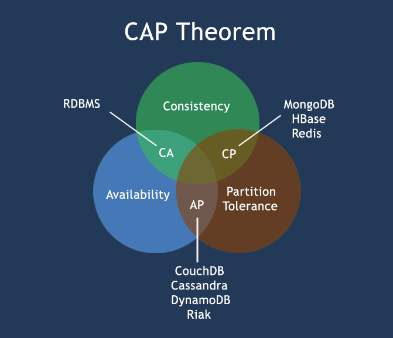

# 数据库记录 - MongoDB

查看:

-   [菜鸟教程 MongoDB 教程](http://www.runoob.com/mongodb/mongodb-tutorial.html)
-   [MongoDB 官网地址](https://www.mongodb.com/)
-   [MongoDB 官方英文文档](https://docs.mongodb.com/manual/)
-   [MongoDB 各平台下载地址](https://www.mongodb.com/download-center#community)

> 以下均摘抄自菜鸟教程

## 简介

MongoDB 是一个基于分布式文件存储的数据库。由 C++ 语言编写。旨在为 WEB 应用提供可扩展的高性能数据存储解决方案。

MongoDB 是一个介于关系数据库和非关系数据库之间的产品，是非关系数据库当中功能最丰富，最像关系数据库的。

## 理论: CAP定理（CAP theorem）

在计算机科学中, CAP定理（CAP theorem）, 又被称作 布鲁尔定理（Brewer's theorem）, 它指出对于一个分布式计算系统来说，不可能同时满足以下三点:

-   一致性(Consistency) (所有节点在同一时间具有相同的数据)
-   可用性(Availability) (保证每个请求不管成功或者失败都有响应)
-   分隔容忍(Partition tolerance) (系统中任意信息的丢失或失败不会影响系统的继续运作)

CAP理论的核心是：一个分布式系统不可能同时很好的满足一致性，可用性和分区容错性这三个需求，最多只能同时较好的满足两个。

因此，根据 CAP 原理将 NoSQL 数据库分成了满足 CA 原则、满足 CP 原则和满足 AP 原则三 大类：

-   CA - 单点集群，满足一致性，可用性的系统，通常在可扩展性上不太强大。
-   CP - 满足一致性，分区容忍性的系统，通常性能不是特别高。
-   AP - 满足可用性，分区容忍性的系统，通常可能对一致性要求低一些。

## 原则: BASE

BASE：Basically Available, Soft-state, Eventually Consistent。 由 Eric Brewer 定义。

CAP理论的核心是：一个分布式系统不可能同时很好的满足一致性，可用性和分区容错性这三个需求，最多只能同时较好的满足两个。

BASE是NoSQL数据库通常对可用性及一致性的弱要求原则:

-   Basically Availble --基本可用
-   Soft-state --软状态/柔性事务。 "Soft state" 可以理解为"无连接"的, 而 "Hard state" 是"面向连接"的
-   Eventual Consistency -- 最终一致性， 也是是 ACID 的最终目的。
