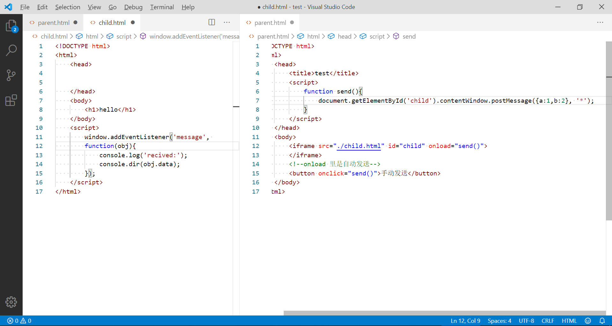

# JS Iframe postMessage

碰到了这样一种处境:

在本网站中,需要嵌入或者跳转到其他的网站,同时需要携带一些参数.

其中有一些可能是很敏感的数据,包括用户 ID,token,和权限标识等等.

这里有这样几种方式:

## 直接跳转

这个就很基本了,使用函数

```js
let targetWebsite = "http://tag.yourwebsite.com";
let params = {
  id: "1",
  token: "2",
  authority: "3"
};
let targetWebsiteUrl = Object.keys(params).reduce((res, key, index) => {
  return (res += !!index ? `&${key}=${params[key]}` : `?${key}=${params[key]}`);
}, targetWebsite);

window.open(targetWebsiteUrl, "_blank");
```

就可以了.

这样做的巨大弊端就是,无论是谁看到这个链接,自然就看到了所有的参数,这对于一个系统来说是极度危险的.

## 嵌入 Iframe

这种操作和之前一样,都是将参数整合到链接之中,唯一的区别就是这种方式增加了一层 `遮羞布`,只有转入页面之中才能获取到对应的参数.

```html
<ifame src="" id="child-iframe"></ifame>
```

```js
let targetWebsite .........
document.getElementById('child-iframe').src = targetWebsiteUrl;
```

相比于第一种方法,这种可以查看到链接的方式,依然不安全,还是会带来巨大的隐患.

## 使用 postMessage 方法

### postMessage 应用

在父页面中,调用此方法

```html
<ifame src="" id="child-iframe"></ifame>
```

```js
$("#child-iframe").load(function() {
  document.getElementById("child-iframe").contentWindow.postMessage(
    {
      id: id,
      token: token,
      authority: authority
    },
    "*"
  );
});
```

在子页面中,需要对响应参数进行接收

```js
window.addEventListener("message", function(obj) {
  console.log("recived:", obj);
  // 在此进行操作
});
```


举例,可下载一下这个包: <a href="assets/postMessage.zip" target="_blank" >postMessage.zip</a>



将两个页面放到不同的两个服务器或者服务中,保证同源策略不可直接访问

然后,将 parent.html 中的链接改为 child.html 所在的地址,可进行测试.


### postMessage 介绍

在 HTML5 中新增了 postMessage 方法，postMessage 可以实现跨文档消息传输（Cross Document Messaging），Internet Explorer 8, Firefox 3, Opera 9, Chrome 3 和 Safari 4 都支持 postMessage。

该方法可以通过绑定 window 的 message 事件来监听发送跨文档消息传输内容。

1. postMessage是HTML5 XMLHttpRequest Level 2中的API，且是为数不多可以跨域操作的window属性之一，它可用于解决以下方面的问题：

  - 页面和其打开的新窗口的数据传递
  - 多窗口之间消息传递
  - 页面与嵌套的iframe消息传递
  - 上面三个场景的跨域数据传递

2. postMessage用法：

> postMessage(data,origin)方法接受两个参数
> 参数说明：
> **data**： html5规范支持任意基本类型或可复制的对象，但部分浏览器只支持字符串，所以传参时最好用JSON.stringify()序列化。
> **origin**： 协议+主机+端口号，也可以设置为"*"，表示可以传递给任意窗口，如果要指定和当前窗口同源的话设置为"/"。

### postMessage 的优势

在不同窗口的信息传递中,使用 postMessage 方法,可以将数据进行隐性的传递,以保证数据的安全性.
