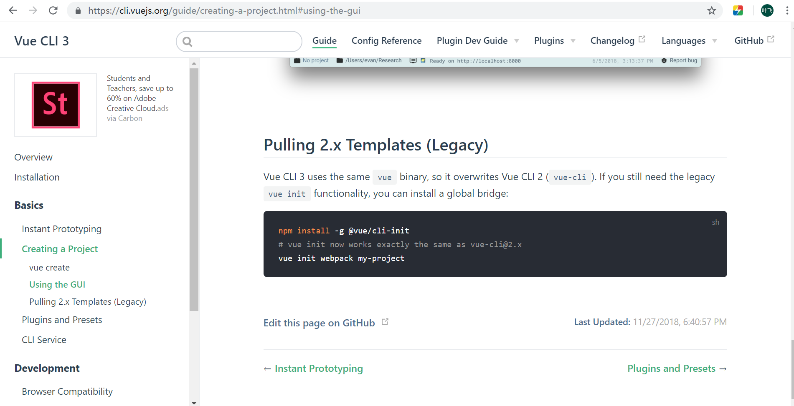
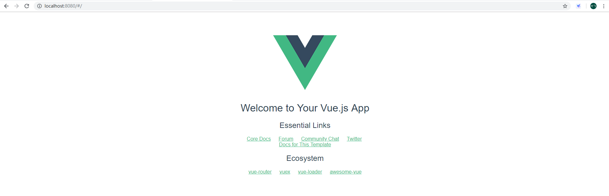
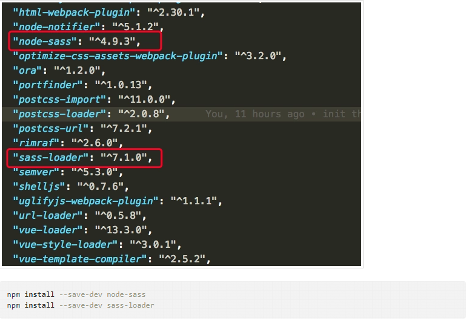

# Vue

## 初始化一个 Vue 项目

### 基础知识

1. 安装 Node.js,请查看 [nodejs 官网](http://nodejs.cn/),建议将 npm 源替换为国内源,如 [淘宝 NPM 镜像 cnpm](http://npm.taobao.org/)
2. 熟悉 vue 的概念和相关组件,请查看 [Vue 官网](https://cn.vuejs.org/)
3. 遵循官网的建议,使用官方创建工具 _vue-cli_ 进行项目搭建.在这里进行简单的讲解,更多详情可访问 [vue-cli 官网](https://cli.vuejs.org/)

### 使用 vue/cli-init 创建 vue 模板



安装 vue/cli-init

```shell
$ cnpm install -g @vue/cli
$ cnpm install -g @vue/cli-init
```

安装完成后,进行项目的创建

```shell
$ vue init webpack vue_workspace
```

在提示中选择要使用的功能,全选即可.

此时生成了一个简单的 vue 项目模板,执行以下命令进行启动项目

```shell
$ cd vue_workspace
$ npm start
```

可以看到执行结果



> 注意: 当在 main.js 中引入全局样式时,会报错
>
> ```
> This relative module was not found:
> * ~/css/style.scss in ./src/main.js
> ```
>
> 这是因为此模板不自带 `sass-loader`, 所以需要手动安装
> 
