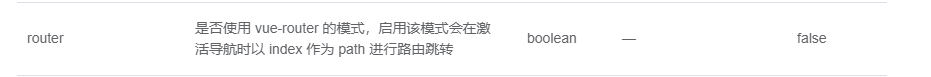

# Vue 将路由绑定到菜单

## 使用 element-ui.menu 的 router 属性

先查看 [element-ui menu](http://element-cn.eleme.io/#/zh-CN/component/menu) ,在配置中可以找到 router 属性:



### 添加 router 属性

根据提示可以知道,在点击菜单项时,会获取其 index 属性值,然后作为 vue-router 的导航来用,这样就简化了设置每次操作的跳转. 例如:

```
<template>
    ....
    <el-menu default-active="note" class="asider-menu" :collapse="isCollapse" router >
      <el-menu-item index="note"></ele-menu-item>
    ....
</template>
```

这样在点击 note 项的时候,会自动跳转到 host/#/note 页面.

### 将路由的具体配置引入到菜单中

```

<template>
  <section>
    <el-menu default-active="note" class="asider-menu" :collapse="isCollapse" router>
      <!-- 将路由文件导入进来,将 route.path 设置到 index 属性, 添加 route.iconClass 属性,为每个一级菜单项设置图标 -->
      <el-menu-item v-for="route in routes" :key="route.path" :index="route.path">
        <i :class="route.iconClass"></i>
        <span slot="title">{{route.name}}</span>
      </el-menu-item>
      <!-- 插入一个控制菜单折叠的按钮 -->
      <el-button :class="{'asider-button':true,'asider-button-collapse':isCollapse}" :icon="isCollapse?'el-icon-d-arrow-right':'el-icon-d-arrow-left'" @click="toggleMenu">
        {{isCollapse?'':'Toggle Menu'}}
      </el-button>
    </el-menu>
  </section>
</template>
<script type="text/javascript">
+  import { routes } from '@/router/routes';
    export default {
      data() {
        return {
           // 获取到从根目录起始的所有子目录
+        routes: routes.find(ele => ele.path == '/').children,
        }
      },
      ....
    }
</script>

```

## 根据路径高亮对应菜单

做到以上,可以正常使用菜单的路由了,但是,有一个新的问题:

> 当我们在浏览器地址栏直接输入路径时,对应的菜单并没有高亮

还需要进一步设置

```
<template>
    ....
    <el-menu :default-active="activeMenuItem" class="asider-menu" :collapse="isCollapse" router>
    ....
</template>
<script type="text/javascript">
....
  data() {
      ....
      activeMenuItem: '',
  },
  watch:{
    // 持续检测路由变化.
    '$route': function (currentRoute) {
      this.activeMenuItem = currentRoute.path;
    }
  }, .....
  created(){
    // 在第一次载入时,获取当前路由信息
    this.activeMenuItem = this.$route.path;
  }
....
</script>
```

这样就可以根据当前路径高亮对应菜单了
