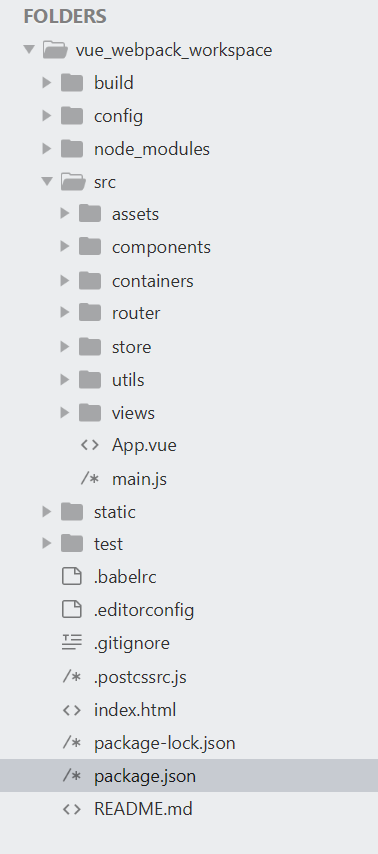

# Vue 目录结构

## vue 项目文档结构

此处说明一下目录结构,截图如下:



### build


此目录用于存放 **编译** 和 **打包** 项目文件的配置,主要使用的工具就是 **webpack**.

### config


此目录用于配置项目整体环境.

### dist

此目录用于存放编译后的项目文件.
在部署时,执行命令:

```
$ npm run build
```

会生成此目录,将其中的文件全部拷贝到服务器页面目录,即可完成部署.

### node_modules

项目依赖包存放目录.

### src


源码存放目录,这里是主要的工作空间.

#### assets

要用到的各种资源.
比如,使用 @vue/cli-init 创建项目时,此处存放 vue 的 logo.
但是现在建议将需要用到的其他资源文件统一放到 static 文件夹下,进行统一管理.

#### components

可复用组件 的存放目录.
可以将项目中常用到的 vue 组件,或在多个文件中都可能用到的 vue 组件,存放在此目录下.

#### containers

容器组件 的存放目录.
容器组件通常指具有特定的页面布局,很少会被复用的组件.
比如,登陆页面, 主页面的各个区域(顶部栏,侧边栏,底部栏 ...), 等

#### router

路由管理目录
将所有的 vue-router 路由管理功能统一集中到此目录下.

#### store

状态管目录
将所有存放在 vuex 中的状态管理功能统一集中到此目录下.

> 建议:
> store 中不必存放所有的状态,其实将各个页面会复用的状态存放在 store 中即可.
> 如果一个数值只在其当前页面中被调用,那么这个值/状态根本不必存放在 store 中.

#### utils

工具函数存放目录
将项目中可能会用到的工具函数存放在此目录下.

#### views

页面文件存放目录
将项目中的子页面统一存放在此处.子页面是指除去顶部栏,侧边栏等全局组件后,进行详细业务处理的页面文件.
这个目录是操作最频繁的,因为几乎所有的业务场景的处理文件都要存放在此文件夹下.

#### APP.vue

vue 项目的总桥接文件
将此 vue 项目和实际的 html 文档连接在一块

#### main.js

vue 的总配置文件
将此 vue 项目的所有全局 vue 配置进行统一管理,包括

- Vue 配置
  - Vue 默认配置
  - 全局方法的绑定
- Vue-Router 配置的引入
- Vuex 配置的引入
- 全局组件库的引入

#### static

静态文件的存储目录
将项目中所有需要用到的静态文件存放在此处,包括

- 图片文件
- 外部组件包的源码文件
- 全局样式文件
- 全局字体(含图标库)文件

#### test

测试文件的存放目录
目前支持两种测试方式,单元测试(unit testing)和端到端测试(e2e testing)

#### 单元测试(unit testing)

站在程序员的角度测试
unit 测试是把代码看成是一个个的组件。从而实现每一个组件的单独测试，测试内容主要是组件内每一个函数的返回结果是不是和期望值一样。

#### 端到端测试(e2e testing)

站在用户角度的测试
e2e 测试是把我们的程序堪称是一个黑盒子，我不懂你内部是怎么实现的，我只负责打开浏览器，把测试内容在页面上输入一遍，看是不是我想要得到的结果。

#### .babelrc

babel 配置文件
此文件用于将新语法代码转换为原生 JS
详见 [Babel 官网](https://www.babeljs.cn/docs/usage/babelrc/)

#### .editorconfig

控制编辑格式
详见 [EditorConfig 官网](https://editorconfig.org/)

#### .gitignore

git 忽略管理
工具网站 [Gitignore.io](https://www.gitignore.io/)

#### .postcssrc.js

参见 [postcss-load-config](https://github.com/michael-ciniawsky/postcss-load-config)

### index.html

项目承载文件

### package.json

Node 配置文件

### README.md

项目说明文件
