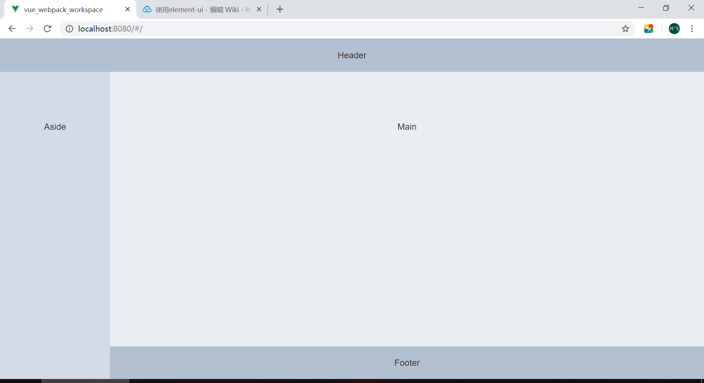

# Vue 使用 Element-UI

查看 [Element-UI 官网](http://element-cn.eleme.io/#/zh-CN/component/installation)

## npm 安装

执行以下命令,将 element 包添加到本地.

```
$ npm i element-ui -S
```

## 在项目中引入 element-ui

此时我们采用完整引入,如需要部分引入请看 [Element-UI 按需引入](http://element-cn.eleme.io/#/an-xu-yin-ru)
在 main.js 中写入以下内容：

```
....
import Vue from 'vue';
+ import ElementUI from 'element-ui';
+ import 'element-ui/lib/theme-chalk/index.css';
....
+ Vue.use(ElementUI);
....
new Vue({....});
```

以上代码便完成了 Element 的引入。需要注意的是，样式文件需要单独引入。

## 修改模板文件

将 element 官方实例直接复制到此项目中,现将 HelloWorld.vue 重命名为 Container.vue, 并将其内容修改如下:

```
<template>
  <el-container class="main-container">
    <el-header>Header</el-header>
    <el-container>
      <el-aside width="200px">Aside</el-aside>
      <el-container>
        <el-main>Main</el-main>
        <el-footer>Footer</el-footer>
      </el-container>
    </el-container>
  </el-container>
</template>
<script>
export default {
  name: 'Container',
  data() {
    return { }
  }
}

</script>
<!-- Add "scoped" attribute to limit CSS to this component only -->
<style scoped>
.main-container {
  /* 将页面高度铺满 */
  min-height: -webkit-fill-available;
}
.el-header,
.el-footer {
  background-color: #B3C0D1;
  color: #333;
  text-align: center;
  line-height: 60px;
}
.el-aside {
  background-color: #D3DCE6;
  color: #333;
  text-align: center;
  line-height: 200px;
}
.el-main {
  background-color: #E9EEF3;
  color: #333;
  text-align: center;
  line-height: 160px;
}
body>.el-container {
  margin-bottom: 40px;
}
</style>
```

可启动程序,查看效果:

