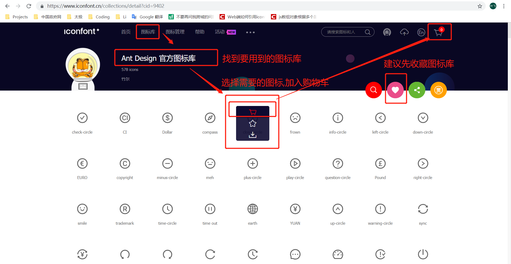
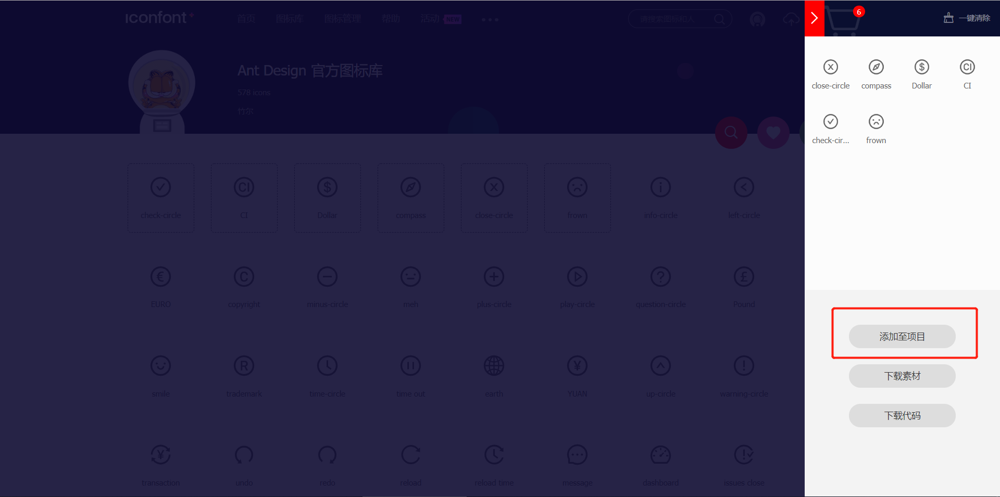
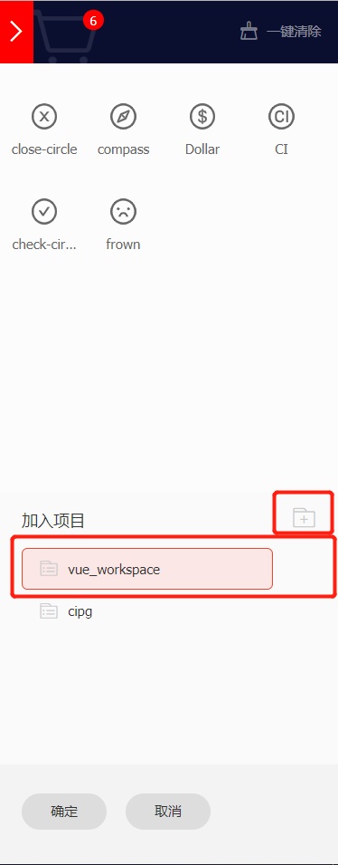
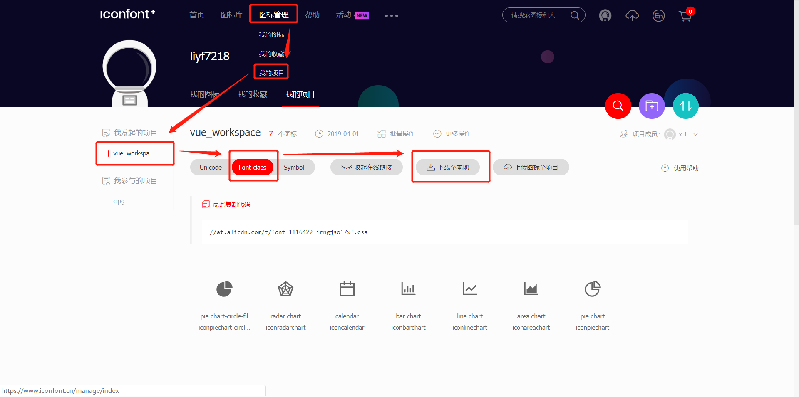
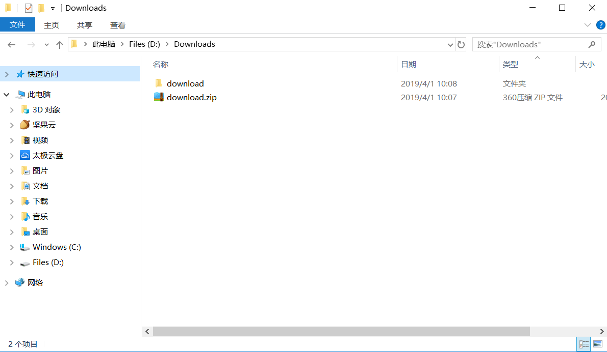
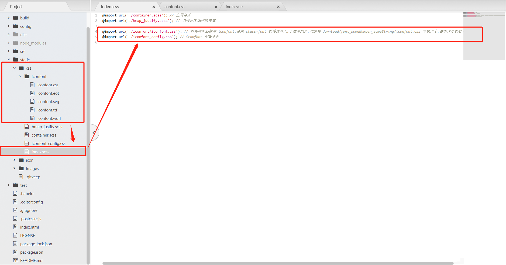
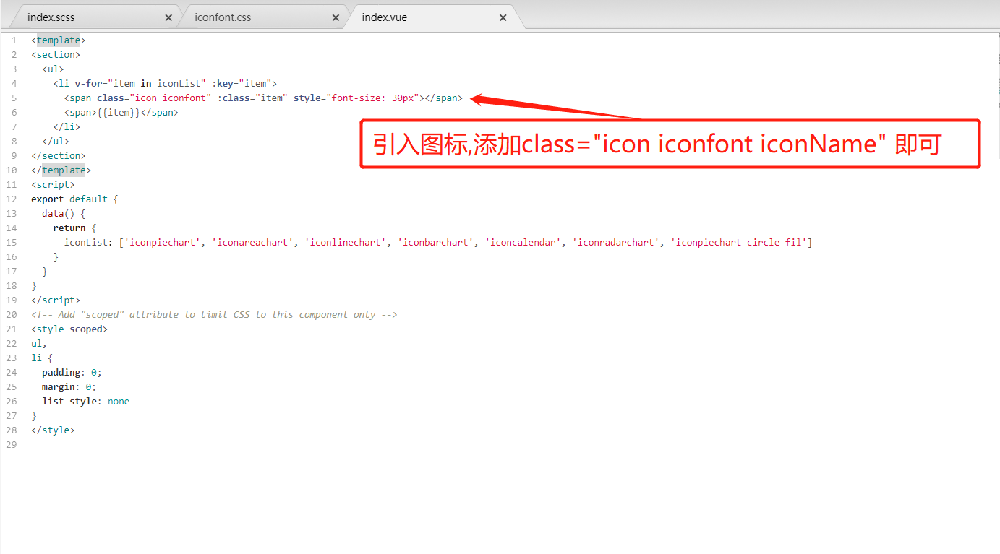

# Vue 使用 Iconfont

### 相关网站

[阿里图标库 Iconfont 官网](https://www.iconfont.cn/)

[阿里图标库 Iconfont 帮助手册 - 代码应用](https://www.iconfont.cn/help/detail?spm=a313x.7781069.1998910419.15&helptype=code)

其他:

[CSDN Web 端如何引用 iconfont，iconfont 所有的引用方式](https://blog.csdn.net/TheMisery_Hang/article/details/79825688)

### 使用 font-class 引入图标

找到要使用的图标库,将需要的图标加入到购物车中

打开购物车,选择将图标添加至项目

选择项目,或者新建项目

打开我的项目,选择 **Font Class** 选项卡,选择下载到本地

此时,会得到一个 download.zip 的压缩包文件,进行解压操作

打开解压后的文件夹,可以看到名为 font_projectcode_randomstr 的文件夹,切进去

其中,圈注出来的几个文件是必须的,其他文件是用来直接打开查看效果的 demo 样例

拷贝 圈注的文件(建议直接拷贝此文件夹下的所有文件) 到前端项目 css 样式目录下,并引入到项目中

使用图标, 只需为指定标签(\<span\>, \<i\>, etc)添加样式 class="icon iconfont iconName" 即可

查看引入的结果

