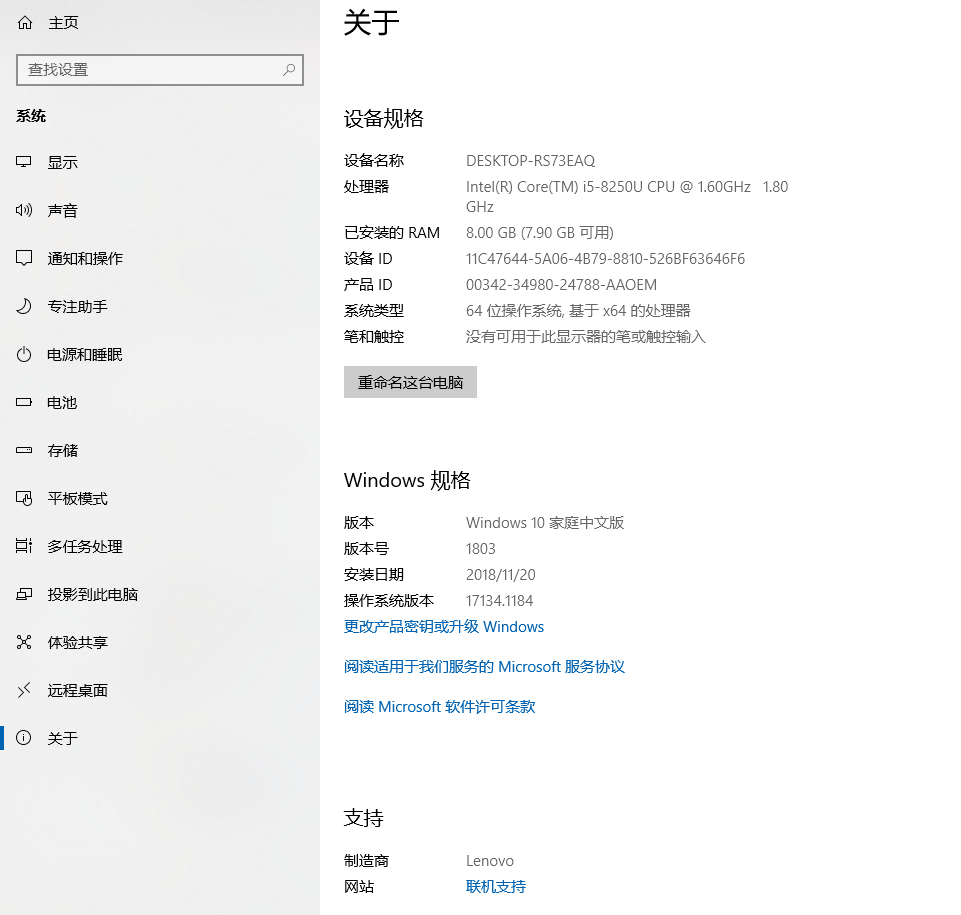
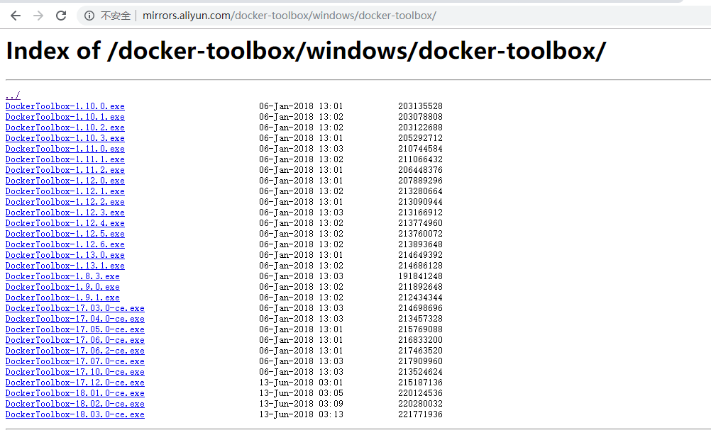
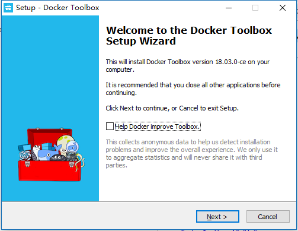
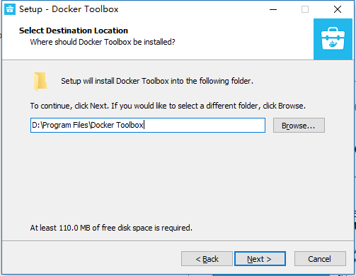
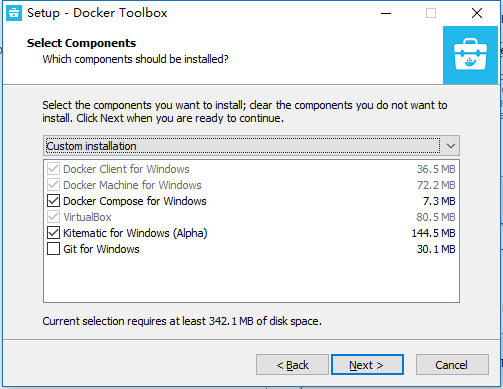
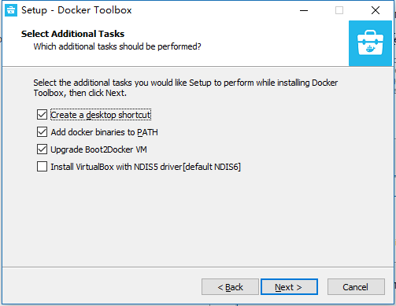
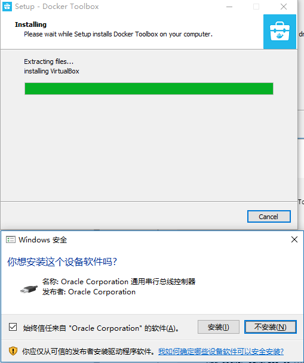
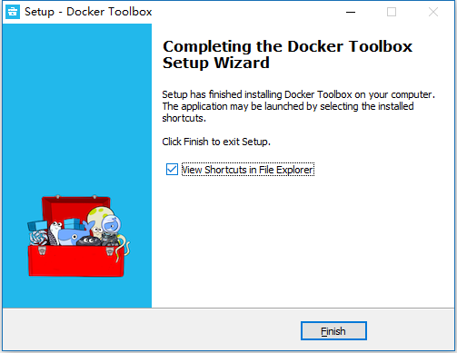

# Docker 安装记录 Win10家庭版

## 查看系统版本



## 下载 Docker-Toolbox

Docker可以支持在mac、windows、linux上安装。但是在windows系统中Docker目前仅有win10专业版和企业版的安装包，win7/win8/win10家庭版需要通过docker toolbox来安装。

下载地址：http://mirrors.aliyun.com/docker-toolbox/windows/docker-toolbox/



点击下载 [DockerToolbox-18.03.0-ce.exe](http://mirrors.aliyun.com/docker-toolbox/windows/docker-toolbox/DockerToolbox-18.03.0-ce.exe)

## 安装 Docker-Toolbox









安装信息:

```
Destination location:
      D:\Program Files\Docker Toolbox

Setup type:
      Custom installation

Selected components:
      Docker Client for Windows
      Docker Machine for Windows
      Docker Compose for Windows
      VirtualBox
      Kitematic for Windows (Alpha)

Additional tasks:
      Create a desktop shortcut
      Add docker binaries to PATH
      Upgrade Boot2Docker VM
```





至此安装完成,可查看三个快捷方式指向的目标文件:

> Docker Quickstart Terminal => C:\Program Files\Git\bin\bash.exe --login -i D:\Program Files\Docker Toolbox\start.sh
> Kitematic (Alpha) => D:\Program Files\Docker Toolbox\kitematic\Kitematic.exe
> Oracle VM VirtualBox => C:\Program Files\Oracle\VirtualBox\VirtualBox.exe
