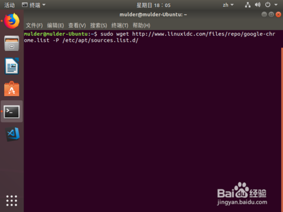
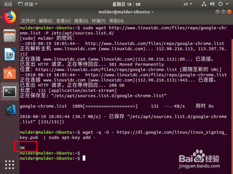

# Ubuntu 安装 Chrome

## 步骤

1. 添加源：

打开 Terminal

```shell
$ sudo wget http://www.linuxidc.com/files/repo/google-chrome.list -P /etc/apt/sources.list.d/
```



2. 添加 Chrome 密钥

```shell
$ wget -q -O - https://dl.google.com/linux/linux_signing_key.pub  | sudo apt-key add -
```



等待出现 `OK`

3. 运行软件更新（这个可省略）

```shell
$ sudo apt-get update
```

4. 安装 Chrome

```shell
$ sudo apt-get install google-chrome-stable
```

5. 运行 Chrome

```shell
$ /usr/bin/google-chrome-stable
# or
$ google-chrome-stable
```
