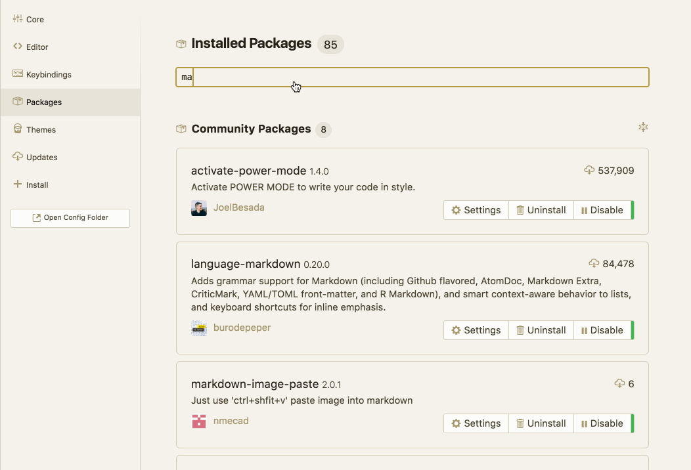
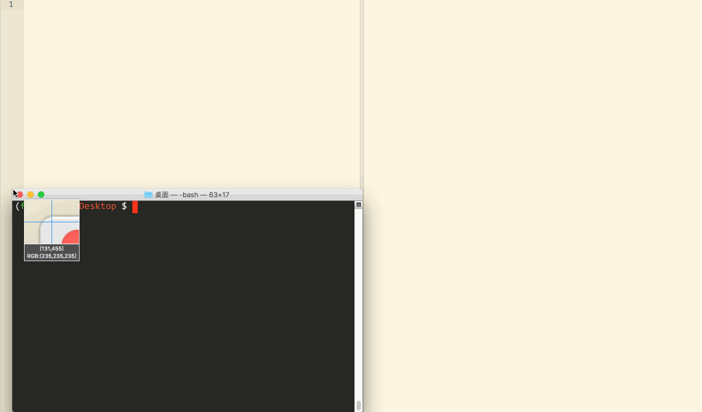
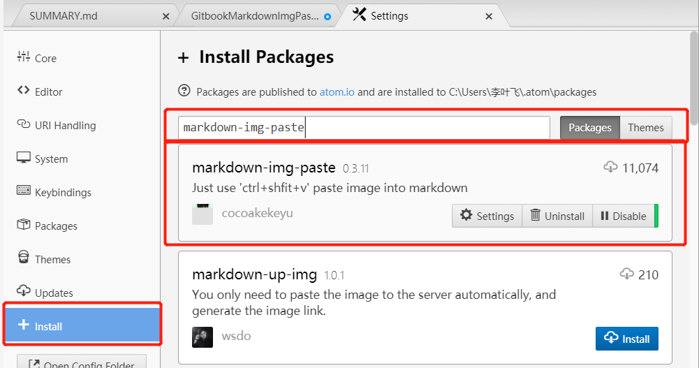
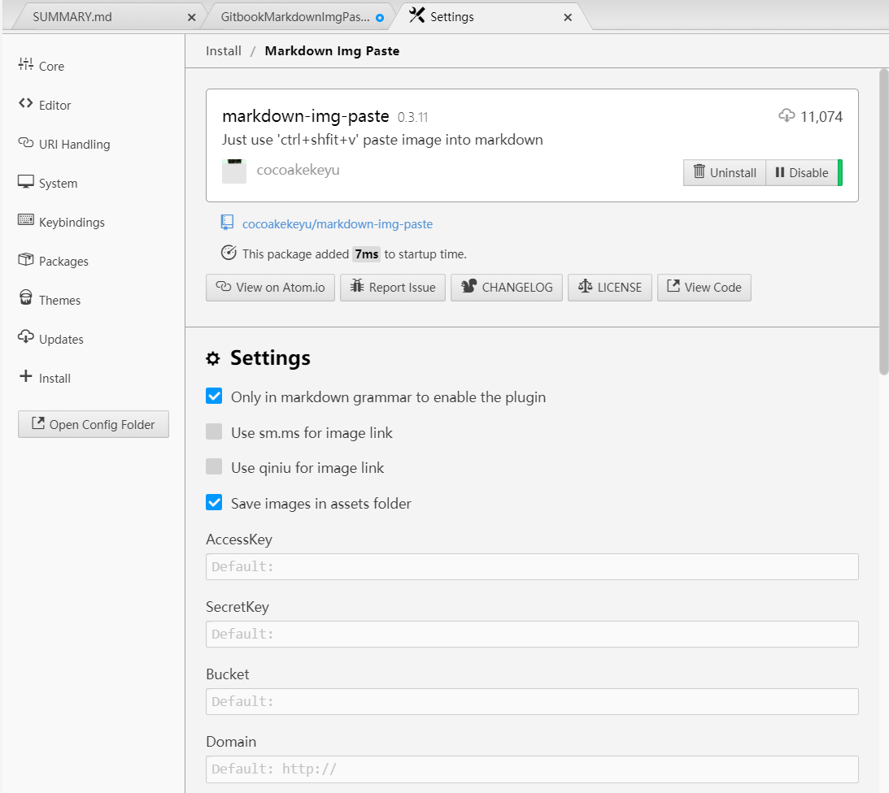
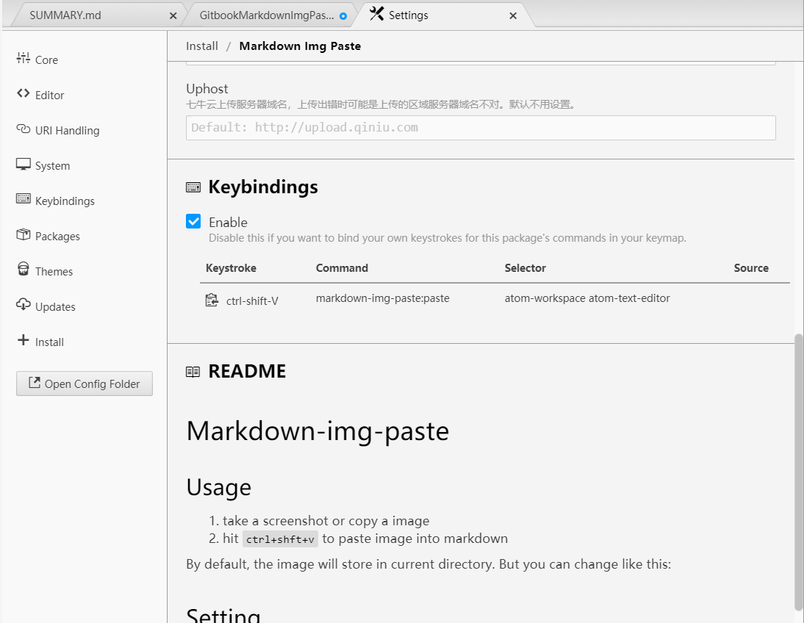

# Gitbook

查看 [Gitbook 官网](https://www.gitbook.com/)

## 安装gitbook

使用 nodejs 包管理器 npm/cnpm 进行安装

```shell
npm install -g gitbook-cli
```

## 基本使用

初始化一个gitbook项目

```shell
gitbook init
```

此时会生成两个文件

1.  SUMMARY.md 目录文件
2.  README.md

安装插件

```shell
gitbook install
```

> 注意! 这种方法特别的慢,我们可以使用 cnpm 直接安装插件,然后在 book.json 里配置即可.
>
> ```shell
> cnpm install gitbook-plugin-pluginName
> ```
>
> 例如,在 book.json 中有配置插件 `splitter`, 那么在使用 cnpm 安装时,要安装的包名应为 `gitbook-plugin-splitter`

查看项目，热编译

```shell
gitbook serve
chrome http://localhost:4000
```

编译项目

```shell
gitbook build
```

## gitbook 工具

### Atom

查看 [CNBlogs 使用Atom打造无懈可击的Markdown编辑器](https://www.cnblogs.com/libin-1/p/6638165.html)

##### 增强预览

Atom自带的Markdown预览插件markdown-preview功能比较简单，markdown-preview-plus对其做了功能扩展和增强。

1.  支持预览实时渲染。(Ctrl + Shift + M)
2.  支持Latex公式。(Ctrl + Shift + X)

使用该插件前，需要先禁用markdown-preview。



查看实时渲染和公式编辑功能。


##### 同步滚动(markdown-scroll-sync)

同步滚动是Markdown编辑器的必备功能，方便翻阅文档修改时能快速定位到预览的位置。

markdown-scroll-sync不仅支持同步滚动，在光标位置发生变更时也会同步滚动，这个功能在很多Markdown编辑器中不具备。


##### 代码增强(language-markdown)

一般的Markdown编辑器提供了代码着色等基本功能，language-markdown除了能给代码着色，还提供了快捷的代码片段生成等功能。


##### 图片粘贴(markdown-image-paste)

经测试，这个包不太好使，可以更换为 `markdown-img-paste`

图片功能支持的好坏直接决定了我是否选择使用一个Markdown编辑器。也有不少编辑器和在线的图床绑定，但是这种方式受限于网络。虽然Markdown支持插入本地图片，但是每次插入新图片都是一堆重复操作：截图－命名－保存－插入。markdown-image-paste将这些操作一步完成：

1.  使用截图工具将图片复制到系统剪切板。

2.  在Markdown新起一行输入文件名。

3.  Ctrl + V 会自动把图片保存到Markdown文件相同目录下(因此要求Markdown文件应该先保存)，并命名为刚输入的文件名，同时在刚才输入文件名行处生成img标签。

    

当然，如果想插入gif动图就不能这么简单了，还是老老实实地下载这个工具手工插入吧。

LICEcap: <http://www.cockos.com/licecap/>

##### 图片粘贴(markdown-img-paste)

安装



使用默认配置即可





截图或者复制图片到系统粘贴板,在 atom readme 文件中使用 ctrl-shift-v 进行粘贴即可.

图片会在当前文件所在目录自动新建一个名为 assets 的文件夹,并将图片命名好放置其中.

##### 表格编辑(markdown-table-editor)


##### pdf导出(markdown-themeable-pdf、pdf-view)


### gitbook 插件配置

在执行gitbook init主目录下增加book.json文件做定制化配置

##### gitbook 设置折叠目录

如果有多个目录，Gitbook在浏览器上打开时，默认所有的目录都会打开，当目录比较多时，全部显示不利于阅读。

可以使用插件配置目录折叠，使得打开浏览器时这些目录默认是关闭的。

配置目录折叠功能如下：

    "plugins":[
    　　"expandable-chapters"
    ]

##### Advanced Emoji

支持emoji表情

    "plugins": [
        "advanced-emoji"
    ]

##### Github

添加github图标

    "plugins": [
        "github"
    ],
    "pluginsConfig": {
        "github": {
            "url": "https://github.com/zhangjikai"
        }
    }

##### Emphasize

为文字加上底色

    "plugins": [
        "emphasize"
    ]

##### KaTex

为了支持数学公式, 我们可以使用KaTex和MathJax插件, 官网上说Katex速度要快于MathJax
插件地址
MathJax使用LaTeX语法编写数学公式教程

    "plugins": [
        "katex"
    ]

##### Splitter

使侧边栏的宽度可以自由调节


    "plugins": [
        "splitter"
    ]

##### Mermaid

支持渲染Mermaid图表

    "plugins": [
        "mermaid"
    ]

##### Tbfed-pagefooter

为页面添加页脚

        "plugins": [
           "tbfed-pagefooter"
        ],
        "pluginsConfig": {
            "tbfed-pagefooter": {
                "copyright":"Copyright &copy zhangjikai.com 2015",
                "modify_label": "该文件修订时间：",
                "modify_format": "YYYY-MM-DD HH:mm:ss"
            }
        }

##### Toggle Chapters

是左侧的章节目录可以折叠

    "plugins": ["toggle-chapters"]

##### Sectionx

将页面分块显示

    "plugins": [
       "sectionx"
    ]

### gitbook 安装使用插件

然后在主目录下用命令行执行

```shell
gitbook install
```

会生成node_modules文件夹，配置的插件也会自动下载到该目录下。

在SUMMARY.md文件中配置目录时直接配置目录名称即可，不用配置连接地址，如下:

    　　[目录名称]()

启动后查看即可达到预期。

除此之外，如果目录内容比较多，左边菜单栏显示不下，也可以使用插件来达到放大菜单栏宽度的目的

插件：在book.json中配置splitter，后续步骤与以上一致

除了在book.json中配置外，还可以直接使用命令进行安装，如：npm install gitbook-plugin-splitter。为维护方便，推荐使用book.json文件进行配置。

更多详情,可查看 [gitbook插件官网地址](https://plugins.gitbook.com/)

### gitbook Debug

##### Gitbook Debug Template render error

报错模板:

    error: error while generating page "VueRecords/VueBindVueRouterToMenu.md":

    Template render error: (D:\projects\workspace\liyf_gitbook\VueRecords\VueBindVueRouterToMenu.md) [Line 35, Column 20]
      expected variable end

解决:

查看 [GitbookIO Issue: Windows only "Template render error expected variable end](https://github.com/GitbookIO/gitbook/issues/1827)

简单来说, 当文档中出现双花括号时，会出现识别错误，此时需要声明双括号为原始代码(使用 `` 包裹起来)，而非模板。

    For example:

    

    var Dialog = require('ysp-interior-components').Dialog;
    module.exports = React.createClass({

      getInitialState: function() {
        return { open: false };
      },

      handleClick: function() {
          this.setState({
            open: !this.state.open
        });
      },

      render: function() {
          return (
          <div>
            <AMUI.Button onClick={this.handleClick}>点我显示弹窗</AMUI.Button>
            {this.state.open &&
              <Dialog config={{status: "real"}}>
                <h4 className="modal-title">Modal 标题</h4>
                <span onClick={this.handleClick} className="icon icon-close modal-icon"></span>
                <div className="modal-body">Hello, Modal 内容</div>
              </Dialog>}
          </div>
        );
      }
    });
    
