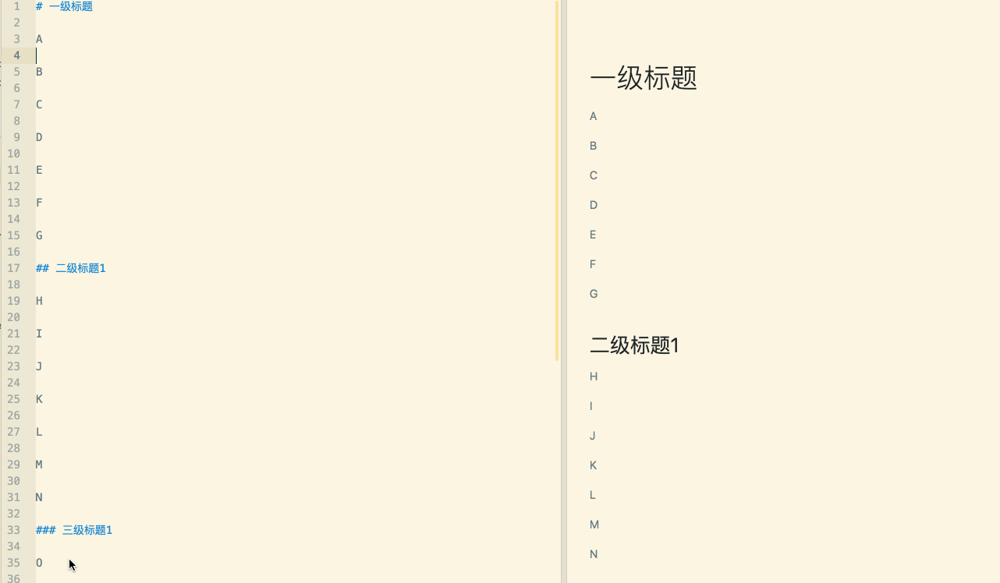
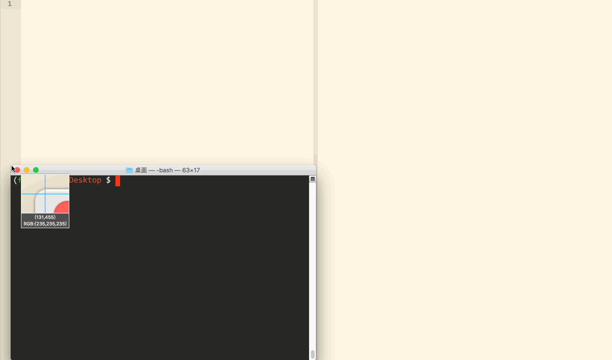
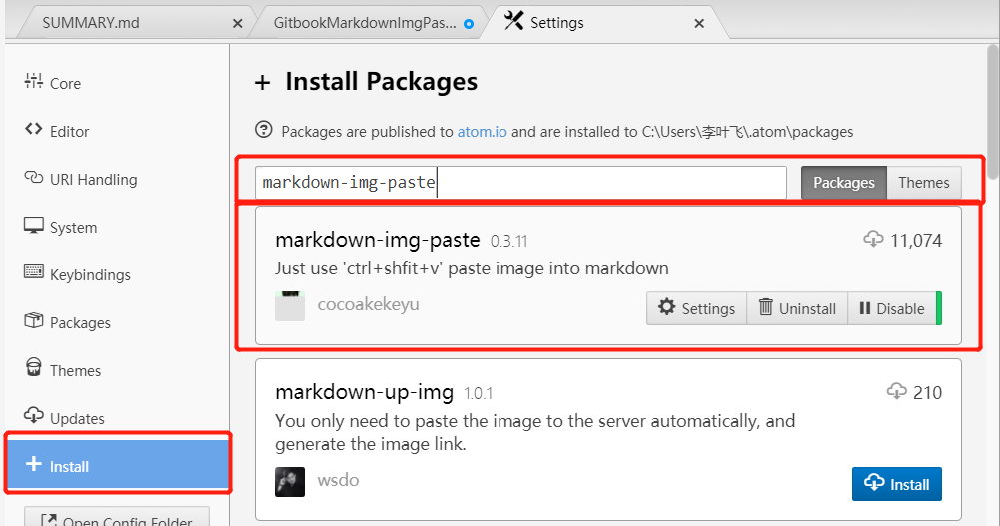
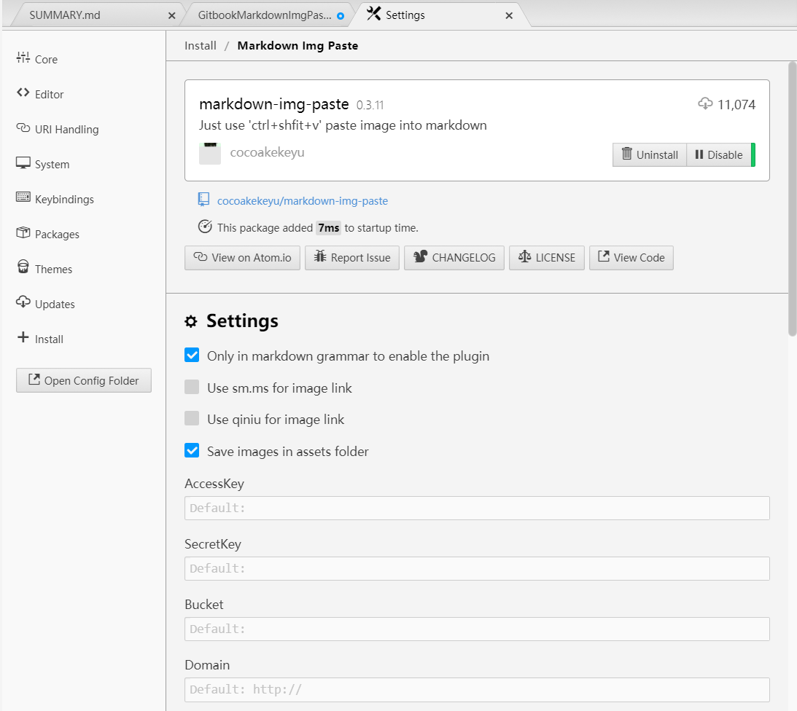
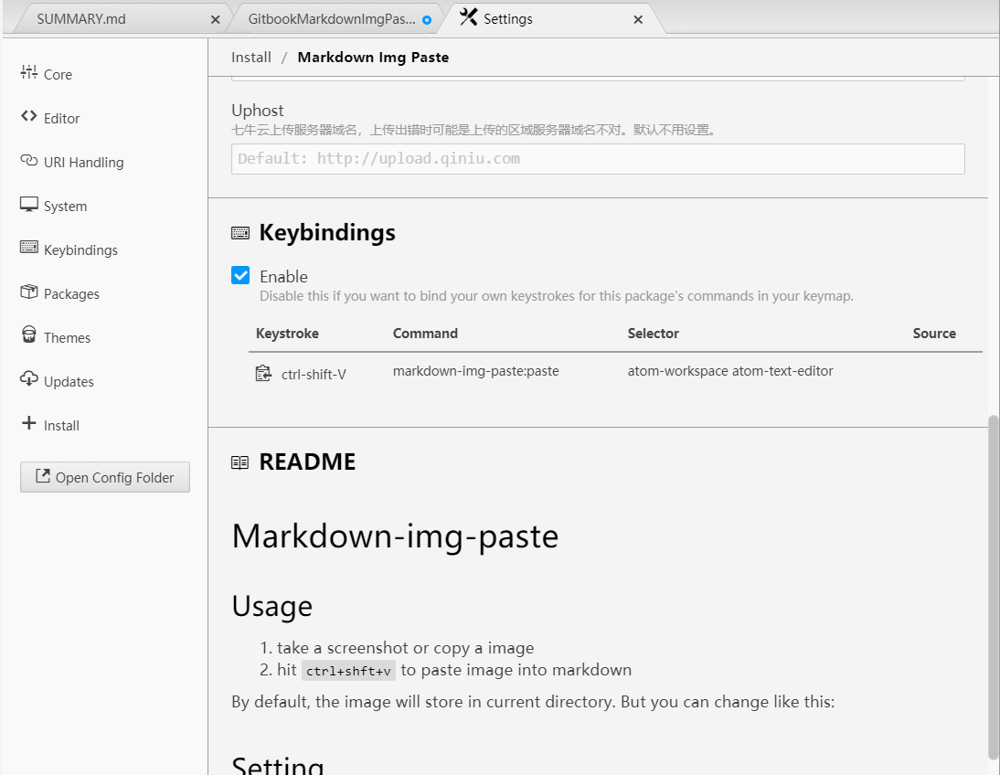
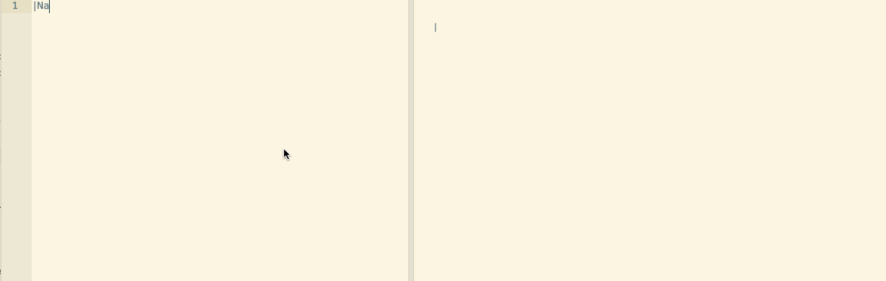
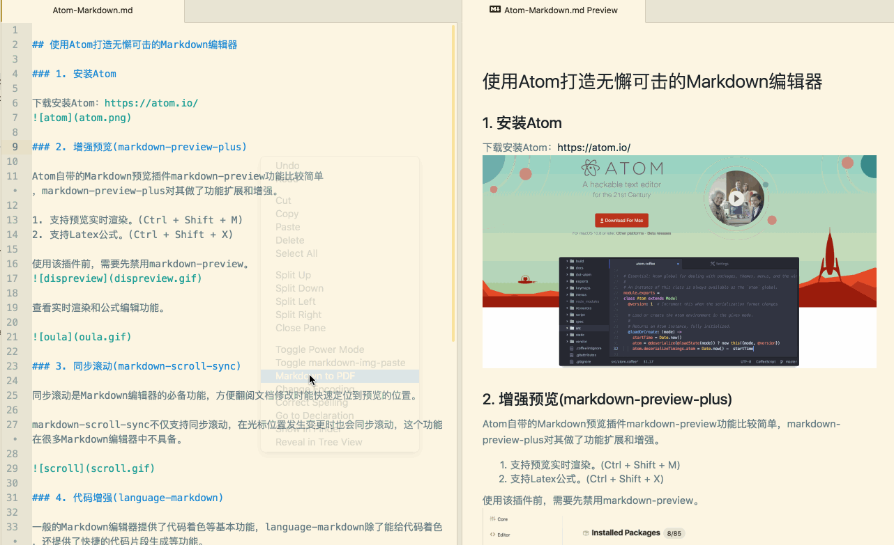

# Atom 中用于编辑 Markdown 文件的工具插件

查看 [CNBlogs 使用Atom打造无懈可击的Markdown编辑器](https://www.cnblogs.com/libin-1/p/6638165.html)

## 增强预览

Atom自带的Markdown预览插件markdown-preview功能比较简单，markdown-preview-plus对其做了功能扩展和增强。

1.  支持预览实时渲染。(Ctrl + Shift + M)
2.  支持Latex公式。(Ctrl + Shift + X)

使用该插件前，需要先禁用markdown-preview。

查看实时渲染和公式编辑功能。

## 同步滚动(markdown-scroll-sync)

同步滚动是Markdown编辑器的必备功能，方便翻阅文档修改时能快速定位到预览的位置。

markdown-scroll-sync不仅支持同步滚动，在光标位置发生变更时也会同步滚动，这个功能在很多Markdown编辑器中不具备。

## 代码增强(language-markdown)

一般的Markdown编辑器提供了代码着色等基本功能，language-markdown除了能给代码着色，还提供了快捷的代码片段生成等功能。

## 图片粘贴(markdown-image-paste)

经测试，这个包不太好使，可以更换为 `markdown-img-paste`

图片功能支持的好坏直接决定了我是否选择使用一个Markdown编辑器。也有不少编辑器和在线的图床绑定，但是这种方式受限于网络。虽然Markdown支持插入本地图片，但是每次插入新图片都是一堆重复操作：截图－命名－保存－插入。markdown-image-paste将这些操作一步完成：

1.  使用截图工具将图片复制到系统剪切板。

2.  在Markdown新起一行输入文件名。

3.  Ctrl + V 会自动把图片保存到Markdown文件相同目录下(因此要求Markdown文件应该先保存)，并命名为刚输入的文件名，同时在刚才输入文件名行处生成img标签。

    

当然，如果想插入gif动图就不能这么简单了，还是老老实实地下载这个工具手工插入吧。

LICEcap: <http://www.cockos.com/licecap/>

## 图片粘贴(markdown-img-paste)

安装

使用默认配置即可

截图或者复制图片到系统粘贴板,在 atom readme 文件中使用 ctrl-shift-v 进行粘贴即可.

图片会在当前文件所在目录自动新建一个名为 assets 的文件夹,并将图片命名好放置其中.

## 表格编辑(markdown-table-editor)

## pdf导出(markdown-themeable-pdf、pdf-view)

