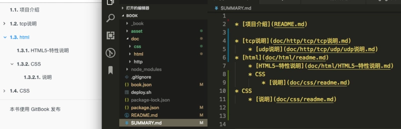

# 配置文件 `book.json`

如果你想对你的网站有更详细的个性化配置或使用插件，那么需要使用配置文件。

配置文件写完后，需要重启服务或者重新打包才能应用配置。

gitbook 的配置文件名是 book.json，首先在项目的根目录中创建 book.json 文件。

book.json 主要内容：

```json
{
  "title": "我的一本书",
  "author": "xxx",
  "description": "我第一本书的描述，很好",
  "language": "zh-hans",
  "structure": {
    "readme": "introduction.md"
  },
  "plugins": ["-lunr", "-search", "search-pro", "back-to-top-button"],
  "pluginsConfig": {
    "anchor-navigation-ex": {
      "isShowTocTitleIcon": true
    }
  },
  "links": {
    "sidebar": {
      "个性链接1": "https://www.baidu.com",
      "个性链接2": "https://www.baidu.com"
    }
  },
  "styles": {
    "website": "styles/website.css",
    "ebook": "styles/ebook.css",
    "pdf": "styles/pdf.css",
    "mobi": "styles/mobi.css",
    "epub": "styles/epub.css"
  }
}
```

## 参数讲解

- root
  包含所有图书文件的根文件夹的路径，除了 book.json
- title
  标题
- author
  作者
- description
  描述，对应 gitbook 网站的 description
- language
  本书的语言类型 —— [ISO code](https://en.wikipedia.org/wiki/List_of_ISO_639-1_codes) 。默认值是 en,中文简体是 zh-hans.
- direction
  文本阅读顺序。可以是 rtl （从右向左）或 ltr （从左向右），默认值依赖于 language 的值。
- structure
  指定 Readme、Summary、Glossary 和 Languages 对应的文件名，下面是这几个文件对应变量以及默认值：

  | Variable            | Description                                 |
  | ------------------- | ------------------------------------------- |
  | structure.readme    | Readme file name (defaults to README.md)    |
  | structure.summary   | 电子书目录 (defaults to SUMMARY.md)         |
  | structure.glossary  | 词汇/注释术语列表 (defaults to GLOSSARY.md) |
  | structure.languages | Languages file name (defaults to LANGS.md)  |

  比如想把 readme 文件个名字，则可以使用如下配置:

  ```json
  "structure": {
      "readme": "introduction.md"
  },
  ```

  使用这个配置后，gitbook 服务就不会找 readme 文件，而去找 introduction 文件当项目说明，这样就可以把 readme 文件完全当成代码仓库说明文档了。

- isbn
  国际标准书号 ISBN
- gitbook
  应该使用的 GitBook 版本，并接受类似于 >=3.0.0 的条件。
- plugins
  使用的插件列表，所有的插件都在这里写出来，然后使用 gitbook install 来安装。
  可查看 [官方插件列表](https://docs.gitbook.com/v2-changes/important-differences#plugins)
- pluginsConfig
  插件的配置信息，如果插件需要配置参数，那么在这里填写。
- links
  目前可以给侧导航栏添加链接信息

  ```json
  "links" : {
      "sidebar" : {
          "个性链接1" : "https://www.baidu.com"
      }
  }
  ```

- styles
  自定义页面样式，各种格式对应各自的 css 文件
  ```json
  "styles": {
      "website": "styles/website.css",
      "ebook": "styles/ebook.css",
      "pdf": "styles/pdf.css",
      "mobi": "styles/mobi.css",
      "epub": "styles/epub.css"
  }
  ```

## 默认带有的 5 个插件

- highlight - 语法高亮插件
- search - 搜索插件
- sharing - 分享插件
- font-settings - 字体设置插件
- livereload - 热加载插件

去除自带插件,可以在插件名称前面加 `-`

```json
"plugins": [
  "-search"
]
```

## 配置默认主题

默认的主题可以通过配置来做一下效果。

比如侧边栏菜单显示标题数字，可以在配置文件的 pluginsConfig 参数中写入如下字段：

```json
{
  "pluginsConfig": {
    "theme-default": {
      "showLevel": true
    }
  }
}
```


