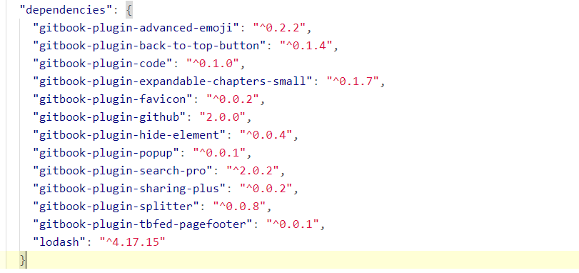
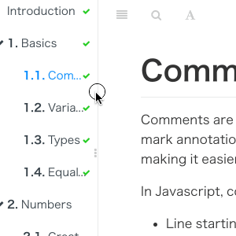

# gitbook 安装使用插件

概述 gitbook 插件的使用,可查看 [gitbook 插件官网地址](https://plugins.gitbook.com/)

## 使用原生安装方式进行插件安装

然后在主目录下用命令行执行

```sh
gitbook install
```

会生成 node_modules 文件夹，配置的插件也会自动下载到该目录下。

> 这种安装方式过程特别缓慢,主要是因为国内链接到 gitbook-plugins 网站的速度慢,所以不建议使用这种安装方式

## 通过 **npm 包** 的方式进行安装(推荐)

本文档就采用这种方式进行 gitbook 插件的安装,主要过程如下:

### 初始化一个 node 项目

  ```sh
  npm init #生成package.json文件
  ```

  这里并不需要真正的搭建项目,只是用生成的 **package.json** 来引进插件包的

### 添加插件依赖到 **package.json**,或者每次添加依赖都使用命令添加

> 使用这种方式时需要注意,所有的 gitbook 插件都需要转换成通用的 npm 包,即
> 在原插件包前添加 **gitbook-plugin-** 字段
> 例: 如果要添加 **splitter** 插件,那么需要在 package.json 中添加 **gitbook-plugin-splitter** 包

```sh
# 添加插件到 dependencies
vi package.json && [insert plugins into dependencies]
```



```sh
# 逐个添加依赖包
cnpm install --save gitbook-plugin-splitter
```

### 将所有依赖包安装完成后,即可启动项目

> 注意:
> 插件一定先要在 book.json 文件里面 plugins 中才能生效，如果只是安装了插件，而没配置的话是不会生效的。

### 另外提及可能出现的各种意外情况

| 错误情况                      | 提示信息                                                                                               | 原因                                                                 | 解决办法                                                                                                                                 |
| ----------------------------- | ------------------------------------------------------------------------------------------------------ | -------------------------------------------------------------------- | ---------------------------------------------------------------------------------------------------------------------------------------- |
| 使用 gitbook serve 命令，报错 | Error: ENOENT: no such file or directory, stat ‘C:\*\*\*demo_book_book\gitbook\gitbook-plugin-xxx\xxx’ | Bug（Vesion：3.2.3）https://github.com/GitbookIO/gitbook/issues/1309 | 用户目录下找到以下文件。 `.gitbook\versions\3.2.3\lib\output\website\copyPluginAssets.js` 将所有 `confirm: true` 修改为 `confirm: false` |


## gitbook 插件配置

在执行 gitbook init 主目录下增加 book.json 文件做定制化配置

### gitbook 设置折叠目录

如果有多个目录，Gitbook 在浏览器上打开时，默认所有的目录都会打开，当目录比较多时，全部显示不利于阅读。

可以使用插件配置目录折叠，使得打开浏览器时这些目录默认是关闭的。

配置目录折叠功能如下：

    "plugins":[
    　　"expandable-chapters"
    ]

### Advanced Emoji

支持 emoji 表情

    "plugins": [
        "advanced-emoji"
    ]

### Github

添加 github 图标

    "plugins": [
        "github"
    ],
    "pluginsConfig": {
        "github": {
            "url": "https://github.com/zhangjikai"
        }
    }

> 这个使用 npm 安装时,记得限定版本为 `2.0.0`,否则报错

### Emphasize

为文字加上底色

    "plugins": [
        "emphasize"
    ]

### KaTex

为了支持数学公式, 我们可以使用 KaTex 和 MathJax 插件, 官网上说 Katex 速度要快于 MathJax
插件地址
MathJax 使用 LaTeX 语法编写数学公式教程

    "plugins": [
        "katex"
    ]

### Splitter

使侧边栏的宽度可以自由调节


    "plugins": [
        "splitter"
    ]

### Mermaid

支持渲染 Mermaid 图表

    "plugins": [
        "mermaid"
    ]

### Tbfed-pagefooter

为页面添加页脚

        "plugins": [
           "tbfed-pagefooter"
        ],
        "pluginsConfig": {
            "tbfed-pagefooter": {
                "copyright":"Copyright &copy zhangjikai.com 2015",
                "modify_label": "该文件修订时间：",
                "modify_format": "YYYY-MM-DD HH:mm:ss"
            }
        }

### Toggle Chapters

是左侧的章节目录可以折叠

    "plugins": ["toggle-chapters"]

### Sectionx

将页面分块显示

    "plugins": [
       "sectionx"
    ]
